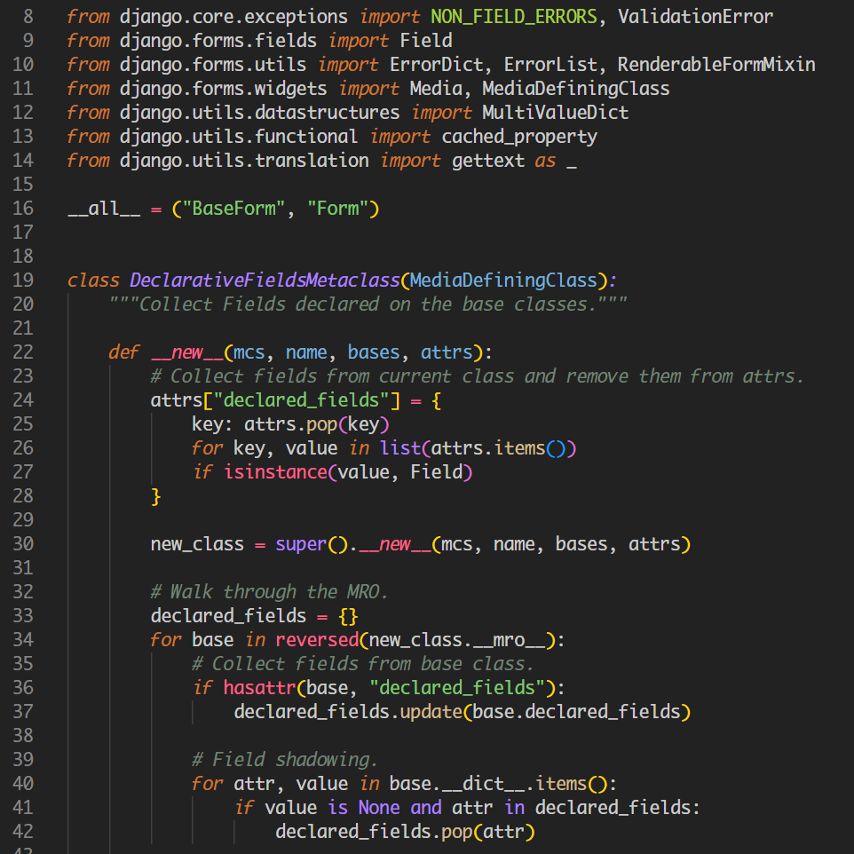
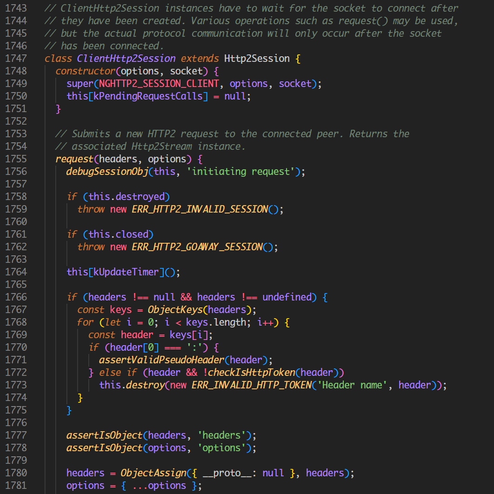
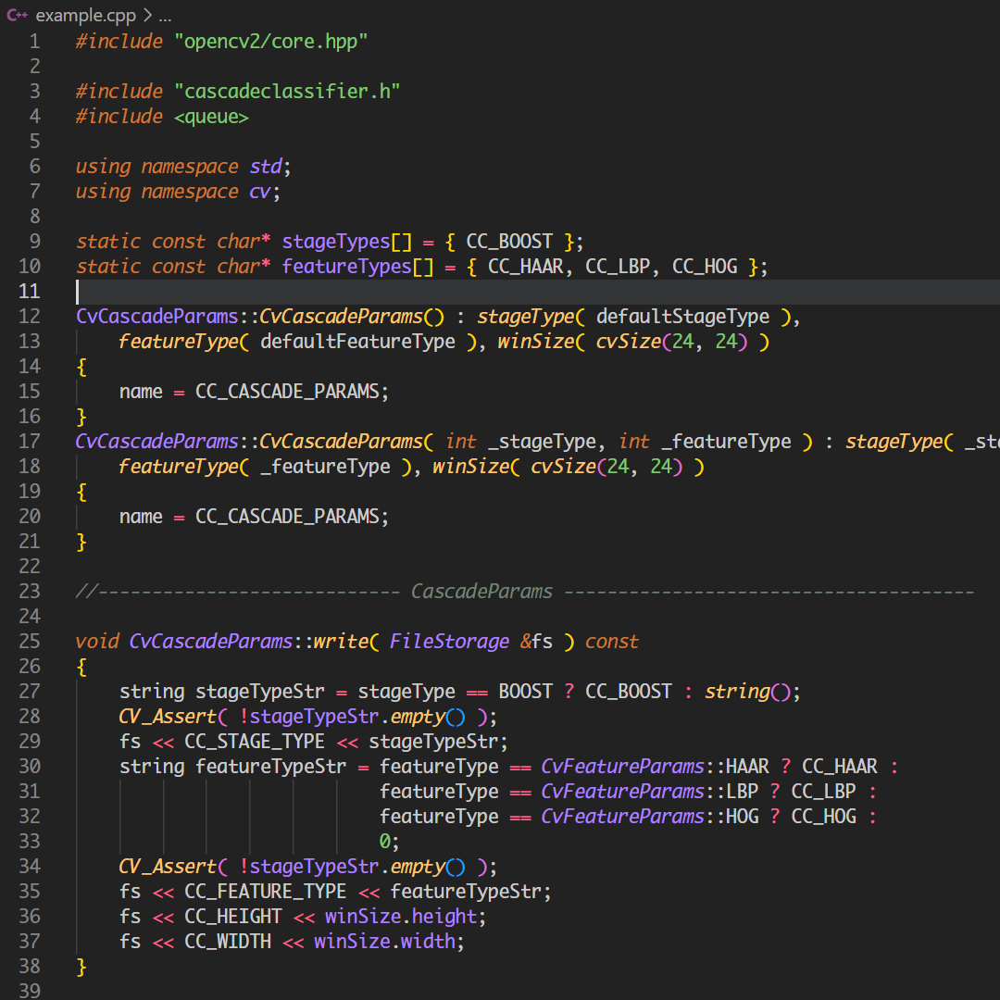
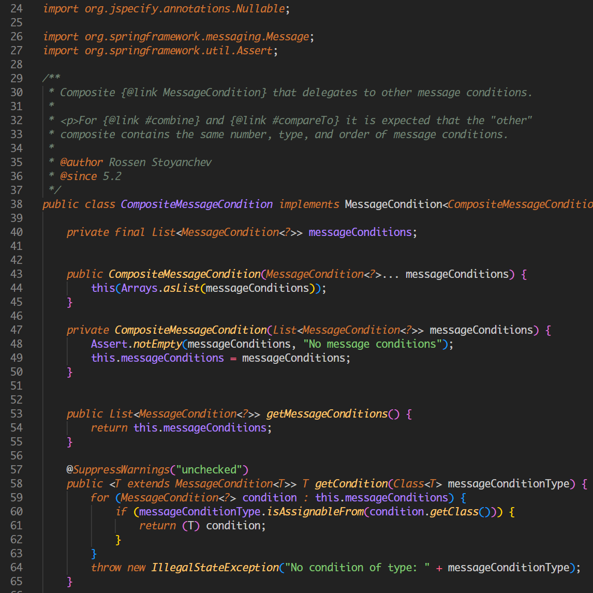

# Dark Prism - Prism of colors over darkness

The idea for this theme was born while working with Python code and wanting a clear yet aesthetically pleasing color scheme. Inspired by the classic Railscasts and Tomorrow Night themes, this design aims to blend the warmth of Railscasts with the subtle contrast of Tomorrow Night.

The theme emphasizes readability, with italicized keywords and comments, distinct colors for functions, variables, and constants, and a carefully chosen palette for operators and decorators. Special attention was given to TODO markers and Markdown elements, making them easy to spot without overwhelming the code.

It’s a humble attempt to create a balanced, comfortable coding experience, especially for Python developers—but hopefully, it can be useful for others as well! 😊

## Examples

### Python example

### JavaScript example

### C++ example

### Java example

## Installation

This extension is available for free in the [Visual Studio Code Marketplace](https://marketplace.visualstudio.com/items?itemName=pchomik.dark-prism).

## Changelog

Click here to go to the [Changelog](https://marketplace.visualstudio.com/items/pchomik.dark-prism/changelog)

 

<b>Have fun and enjoy coding! 😃✨</b>

